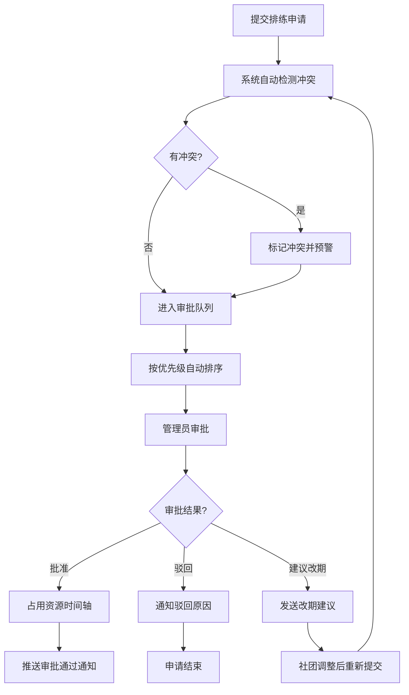

## 1. 产品概述

校园排练统筹平台是面向校艺术团、院系文艺中心和场馆老师的专业协同系统，解决多团队同时争抢礼堂、琴房、舞蹈室等资源时的信息不透明问题，作为校内排练资源的"总调度室"。

- 目标用户：校艺术团管理人员、各院系文艺中心负责人、场馆管理老师
- 核心价值：统一资源调度，减少冲突，提升场地利用率，实现透明化管理

## 2. 核心功能

### 2.1 用户角色

| 角色 | 登录方式 | 核心权限 |
|------|----------|----------|
| 场馆管理员 | 账号登录 | 全部权限：审批、冲突处理、统计、系统设置 |
| 社团负责人 | 账号登录 | 提交申请、查看审批状态、接收通知 |
| 指导老师 | 账号登录 | 查看排期、确认指导安排 |

### 2.2 功能模块

1. **总览看板**：今日/本周排练概览、资源占用状态、待办审批、冲突预警
2. **审批台**：排练申请列表、自动排序、一键批准/驳回/建议改期
3. **资源库**：场地、设备、指导老师统一时间轴展示、封场时段管理
4. **冲突处理**：时间重叠、人数超载、器材撞车醒目标记、冲突详情
5. **统计报表**：场地利用率、空置率、高峰时段统计、周排练表导出
6. **通知设置**：审批结果推送、变更通知、注意事项模板配置

### 2.3 页面详情

| 页面名称 | 模块名称 | 功能描述 |
|---------|----------|----------|
| 总览看板 | 数据概览卡片 | 今日排练数、待审批数、冲突数、场地使用率 |
| 总览看板 | 今日时间轴 | 按时间线展示当日所有排练安排 |
| 总览看板 | 快捷操作 | 新建申请、快速审批、冲突处理入口 |
| 审批台 | 申请列表 | 按活动级别、演出日期、人数自动排序 |
| 审批台 | 申请详情 | 排练信息、团队信息、资源需求、变更历史 |
| 审批台 | 审批操作 | 批准、驳回、建议改期、添加备注 |
| 资源库 | 场地时间轴 | 多场地并排时间轴，展示占用/空闲状态 |
| 资源库 | 设备管理 | 器材清单、借用记录、库存状态 |
| 资源库 | 老师排期 | 指导老师时间安排与确认状态 |
| 资源库 | 封场管理 | 大型演出预留时段设置 |
| 冲突处理 | 冲突列表 | 时间重叠、人数超载、器材撞车分类展示 |
| 冲突处理 | 冲突详情 | 涉事申请、冲突原因、建议方案 |
| 统计报表 | 利用率统计 | 各场地利用率、空置率图表 |
| 统计报表 | 高峰时段 | 按小时/天统计使用频率 |
| 统计报表 | 周排练表 | 生成周表并支持导出 |
| 通知设置 | 通知模板 | 审批结果、变更通知模板配置 |
| 通知设置 | 推送方式 | 站内消息、短信、邮件推送开关 |
| 通知设置 | 通知记录 | 历史通知发送记录 |

## 3. 核心流程

### 3.1 排练申请审批流程

社团负责人提交排练申请 → 系统自动检测冲突 → 进入审批队列按优先级排序 → 管理员审批（批准/驳回/建议改期）→ 结果通知申请社团 → 占用资源时间轴

### 3.2 冲突处理流程

系统实时检测冲突 → 冲突标记与预警 → 管理员介入处理 → 协调改期或调整资源 → 记录变更责任人与原因 → 通知相关方

### 3.3 Mermaid 流程图

## 4. 用户界面设计

### 4.1 设计风格

- **主色调**：深蓝藏青 (#1e3a5f) - 专业、稳重
- **辅助色**：琥珀橙 (#f59e0b) - 警示、强调
- **成功色**：翠绿 (#10b981) - 批准、正常
- **危险色**：珊瑚红 (#ef4444) - 冲突、驳回
- **中性色**：石板灰系列 - 信息层次
- **按钮风格**：圆角 6px，轻微阴影，hover 状态明显
- **字体**：系统无衬线字体，清晰层级
- **布局风格**：左侧导航 + 主内容区，卡片式布局
- **图标风格**：Lucide 线性图标，统一 20px 尺寸

### 4.2 页面设计概述

| 页面名称 | 模块名称 | UI 元素 |
|---------|----------|---------|
| 总览看板 | 数据概览 | 4 张数据卡片，带趋势箭头，网格布局 |
| 总览看板 | 今日时间轴 | 垂直时间线，彩色状态标签，hover 详情 |
| 总览看板 | 冲突预警 | 红色警示卡片，冲突数量与快速处理按钮 |
| 审批台 | 申请列表 | 表格视图，优先级色标，操作列固定 |
| 审批台 | 申请详情 | 右侧抽屉式面板，信息分组展示 |
| 资源库 | 时间轴 | 甘特图样式，多资源并排，拖拽调整 |
| 冲突处理 | 冲突列表 | 卡片式列表，冲突类型图标，严重程度色标 |
| 统计报表 | 图表区域 | 柱状图/折线图组合，时间范围筛选 |
| 通知设置 | 设置面板 | 分组开关，模板预览，发送测试 |

### 4.3 响应式

- Desktop-first 设计，主适配 1440px 宽度
- 侧边栏在平板宽度可收起
- 表格支持横向滚动
- 移动端采用单列布局

### 4.4 交互细节

- 时间轴悬停显示详情气泡
- 冲突项脉冲动画吸引注意
- 审批操作有确认二次弹窗
- 页面切换淡入淡出过渡
- 数据加载骨架屏占位
