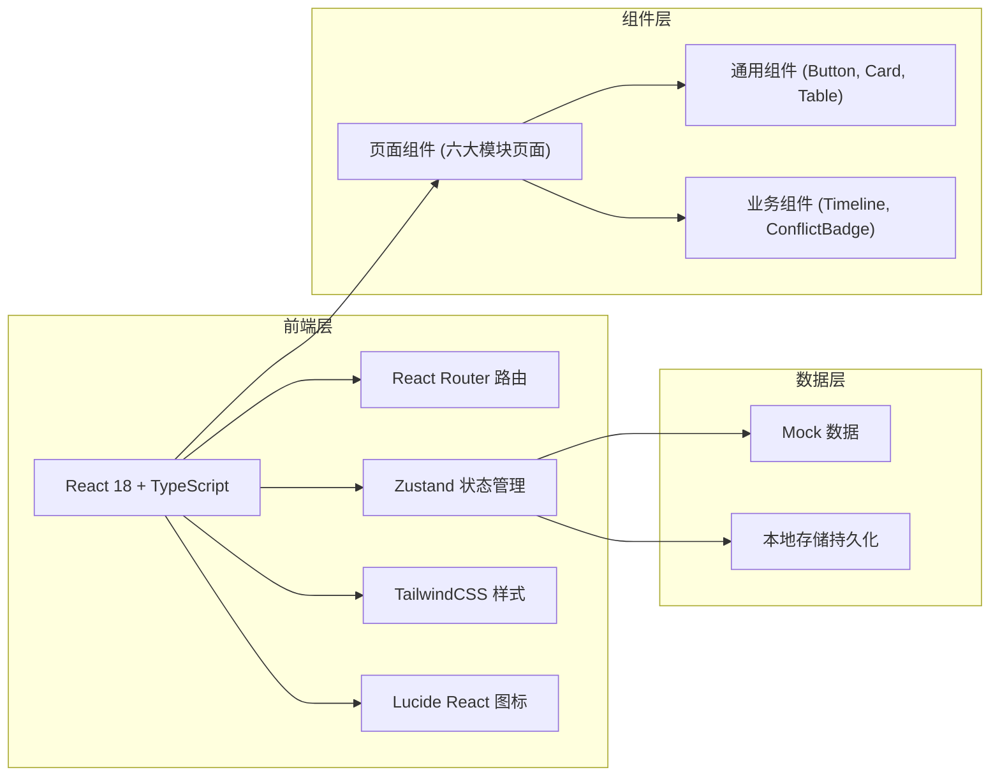
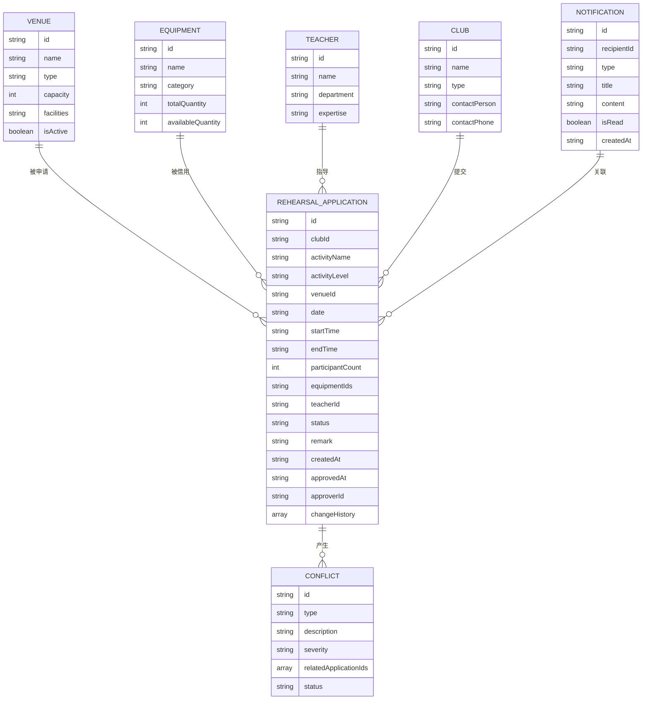

## 1. 架构设计



## 2. 技术描述

- **前端框架**：React 18 + TypeScript
- **构建工具**：Vite 5
- **状态管理**：Zustand
- **路由**：React Router DOM 6
- **样式方案**：TailwindCSS 3
- **图标库**：Lucide React
- **图表库**：Recharts
- **数据方案**：Mock 数据 + LocalStorage 持久化
- **初始化工具**：vite-init (react-ts 模板)

## 3. 路由定义

| 路由路径 | 页面名称 | 说明 |
|---------|---------|------|
| /dashboard | 总览看板 | 首页，数据概览与快捷操作 |
| /approvals | 审批台 | 排练申请列表与审批操作 |
| /resources | 资源库 | 场地/设备/老师时间轴 |
| /conflicts | 冲突处理 | 冲突列表与处理 |
| /statistics | 统计报表 | 数据统计与导出 |
| /settings | 通知设置 | 通知模板与推送配置 |

## 4. 数据模型

### 4.1 核心数据模型



### 4.2 活动级别定义

- **校级重点**：最高优先级，如校庆、迎新晚会
- **院级重点**：次高优先级，如院庆、院迎新
- **日常排练**：普通优先级，社团日常训练
- **临时活动**：最低优先级，临时加排

### 4.3 申请状态定义

- pending：待审批
- approved：已批准
- rejected：已驳回
- rescheduled：建议改期
- cancelled：已取消

### 4.4 冲突类型定义

- time_overlap：时间重叠
- capacity_exceeded：人数超载
- equipment_conflict：器材撞车
- teacher_conflict：指导老师冲突

## 5. 项目结构

```
src/
├── components/          # 通用组件
│   ├── ui/             # 基础 UI 组件
│   │   ├── Button.tsx
│   │   ├── Card.tsx
│   │   ├── Badge.tsx
│   │   ├── Modal.tsx
│   │   └── Table.tsx
│   ├── layout/         # 布局组件
│   │   ├── Sidebar.tsx
│   │   ├── Header.tsx
│   │   └── MainLayout.tsx
│   └── business/       # 业务组件
│       ├── Timeline.tsx
│       ├── ConflictBadge.tsx
│       ├── StatusBadge.tsx
│       └── StatCard.tsx
├── pages/              # 页面组件
│   ├── Dashboard.tsx
│   ├── Approvals.tsx
│   ├── Resources.tsx
│   ├── Conflicts.tsx
│   ├── Statistics.tsx
│   └── Settings.tsx
├── store/              # 状态管理
│   └── useStore.ts
├── data/               # Mock 数据
│   ├── venues.ts
│   ├── applications.ts
│   ├── conflicts.ts
│   └── statistics.ts
├── utils/              # 工具函数
│   ├── dateUtils.ts
│   ├── conflictUtils.ts
│   └── exportUtils.ts
├── types/              # 类型定义
│   └── index.ts
├── App.tsx
├── main.tsx
└── index.css
```

## 6. 核心业务逻辑

### 6.1 自动排序算法

优先级权重：
- 活动级别：校级重点(40) > 院级重点(30) > 日常排练(15) > 临时活动(10)
- 演出日期临近：距离演出日期越近权重越高，最高 30 分
- 人数规模：人数越多权重越高，最高 20 分
- 申请时间：越早申请权重越高，最高 10 分

### 6.2 冲突检测逻辑

1. 时间重叠检测：判断两个申请的时间段是否有交集
2. 人数超载检测：申请人数 vs 场地容量
3. 器材撞车检测：同一设备同一时段被多个申请借用
4. 老师冲突检测：同一老师同一时段被多个申请预约

### 6.3 利用率统计

- 场地利用率 = 实际使用时长 / 可使用时长 × 100%
- 空置率 = 1 - 利用率
- 高峰时段：按小时统计使用频次，取 Top 3 时段
